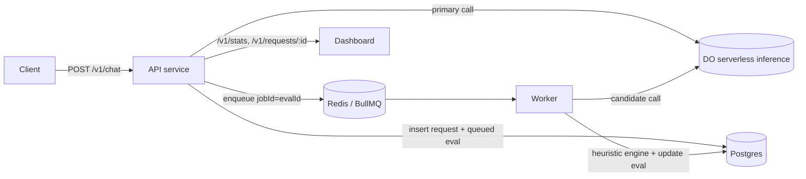

# Shadow LLM Evaluator

Serves a **primary** LLM via `/v1/chat` and, on a sampled fraction of requests, shadow-evaluates
**candidate** models against it using a deterministic, pluggable heuristic engine. Results are
persisted to Postgres and shown on a simple real-time dashboard. Models are served via
**DigitalOcean serverless inference** (OpenAI-compatible). Runs locally via Docker Compose.

## Architecture



## Request lifecycle
1. `POST /v1/chat` → API generates `requestId`, calls the primary, returns it immediately with
   `X-Request-Id`.
2. If the request is sampled, the API inserts one `queued` eval row per candidate and enqueues a
   BullMQ job (`jobId = evalId`).
3. The worker calls the candidate, runs the heuristic engine, and updates the eval row to
   `completed` (or `failed` after retries).
4. Track a request at `GET /v1/requests/:requestId`; watch aggregates on the dashboard (`/`).

## Run locally (Docker)
```bash
cp .env.example .env          # set DO_INFERENCE_KEY (and base URL)
docker compose up --build -d
curl localhost:8080/healthz
open http://localhost:8080/    # dashboard
```

## Run natively (no Docker)
For environments without Docker. Requires local Postgres + Redis.
```bash
# one-time: install + start services, create the db
sudo apt-get install -y postgresql redis-server
sudo service postgresql start && sudo service redis-server start
sudo -u postgres psql -c "CREATE ROLE shadow LOGIN PASSWORD 'shadow' CREATEDB" \
                      -c "CREATE DATABASE shadow OWNER shadow"

cp .env.example .env          # set DO_INFERENCE_KEY; DATABASE_URL/REDIS_URL already point at localhost
npm install && npm run build
npm run start:api &           # http://localhost:8080
npm run start:worker &
curl localhost:8080/healthz
```

### Example request
```bash
curl -s localhost:8080/v1/chat -H 'content-type: application/json' \
  -H 'x-shadow-eval: force' \
  -d '{"model":"primary-llama","messages":[{"role":"user","content":"Return {\"answer\":42} as JSON"}],
       "candidates":["candidate-claude"],"response_format":{"type":"json_object"}}'
```

## Configuration
- **Static** (env / `.env`): connection strings, `DO_INFERENCE_*`, `ADMIN_KEY`, optional `AUTH_KEY`.
- **Dynamic** (runtime, via `GET/PUT /v1/config`): sampling rate + overrides, default candidates,
  heuristic rules/weights/thresholds. Stored versioned in Postgres; read with a ~5s cache.
- **Model catalog**: `config/models.json` (supported model id → DO inference name).

## Heuristic engine
Pluggable rules in `src/shared/heuristics/rules/` (structural, exact-match, text-similarity,
numeric-tolerance, tool-calls). The engine combines enabled rules by weight into a composite
`0–1` score and a pass/fail verdict. Add a dimension = add one rule file + register it.

## Scaling
Stateless API + N BullMQ workers share Postgres/Redis. Demo locally:
```bash
docker compose up -d --scale worker=3
```
The worker is the horizontally-scalable unit (N workers share the Redis queue). The API is
stateless and scales behind a load balancer in a real deploy; locally it runs as a single
published instance.

## Tests
```bash
npm run test:unit          # pure logic, no external services
npm run test:integration   # uses local Postgres + Redis (override TEST_DATABASE_URL / TEST_REDIS_URL)
npm test                   # everything
```
Integration tests create an isolated database per test file against the local Postgres and flush
the local Redis, so they need Postgres + Redis reachable (the "Run natively" services suffice).
